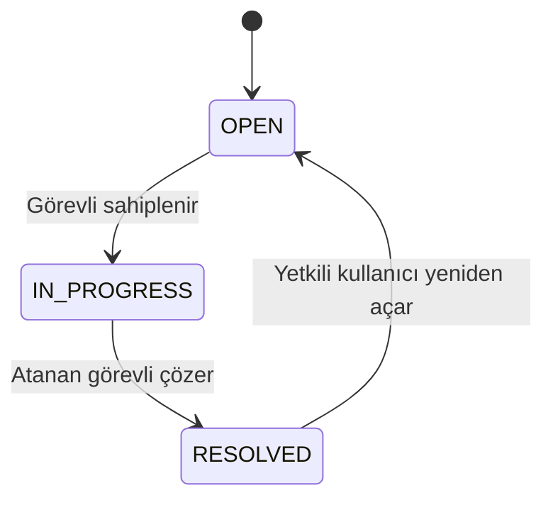

# Servis Takip API

[](https://github.com/HusrevKitapci/servis-takip/actions/workflows/ci.yml)

FastAPI ve PostgreSQL ile geliştirilmiş, ekip bazlı servis talebi yönetim API'si.

Kullanıcılar talep oluşturabilir; ilgili ekipteki servis görevlileri talepleri
sahiplenebilir, yorum ekleyebilir ve çözebilir. Sistem, işlem geçmişini ve
ilk yanıt SLA durumunu kaydeder. Raporlar kullanıcının görme yetkisine göre
hesaplanır.

Proje, backend geliştirme becerilerini uygulamak ve göstermek için hazırlanmıştır.
Etkileşimli kullanım arayüzü Swagger UI'dır; ayrı bir frontend uygulaması içermez.

## 1. Çözülen problem

Bir servis talebinin yalnızca kaydedilmesi yeterli değildir:

- Talebi kim görebilir?
- Hangi ekip ilgilenecek?
- İki görevli aynı anda sahiplenirse ne olur?
- Kim, ne zaman yorum yaptı veya durumu değiştirdi?
- İlk yanıt hedef süresinde verildi mi?
- Bir kullanıcı raporlardan yetkisi dışındaki kayıtları öğrenebilir mi?

Bu proje, bu soruları veri modeli, yetkilendirme, transaction yönetimi
ve otomatik testlerle ele alır.

## 2. Özellikler

- JWT erişim tokenlarıyla kimlik doğrulama.
- Parolaların düz metin yerine parola özeti olarak saklanması.
- Requester, agent ve manager rolleri.
- Ekip oluşturma, aktiflik yönetimi ve ekip üyelikleri.
- Yetkiye göre talep listeleme, filtreleme ve sayfalama.
- Talep sahiplenme, çözme ve yeniden açma.
- Eşzamanlı sahiplenmeye karşı koşullu veritabanı güncellemesi.
- Talep yorumları ve olay geçmişi.
- İlk yanıt SLA değerlendirmesi.
- Kullanıcının görebildiği talepler üzerinden özet rapor.
- İstek kimliği, JSON logları ve genel sunucu hata yanıtları.
- Alembic ile sürümlenmiş veritabanı değişiklikleri.
- Ayrı PostgreSQL test veritabanı.
- Docker ile çalıştırma.
- GitHub Actions ile test ve Docker build kontrolleri.

## 3. Teknolojiler

| Araç | Kullanım amacı |
|---|---|
| Python 3.12 | Uygulama dili |
| FastAPI | HTTP API ve OpenAPI dokümantasyonu |
| Pydantic | Girdi ve ayar doğrulaması |
| SQLAlchemy | Veritabanı sorguları ve oturum yönetimi |
| PostgreSQL 17 | İlişkisel veri saklama |
| Psycopg | PostgreSQL sürücüsü |
| Alembic | Veritabanı migration yönetimi |
| PyJWT ve pwdlib | Token ve parola işlemleri |
| pytest ve HTTPX | Otomatik testler |
| Docker Compose | API ve veritabanını birlikte çalıştırma |
| GitHub Actions | Sürekli entegrasyon |

Kurulu Python paketlerinin sürümleri requirements.txt içinde bulunur.
Bu dosya geliştirme ve test bağımlılıklarını birlikte içerir.

## 4. Roller ve erişim

| Rol | Temel sorumluluk |
|---|---|
| requester | Kendi taleplerini oluşturur ve takip eder. |
| agent | Kendi taleplerini ve üyesi olduğu ekiplerin taleplerini görür; iş akışı kuralları içinde görev alır. |
| manager | Ekip ve görevli yönetimini yapar, bütün talepleri görebilir. |

Normal kullanıcı kaydı rol seçimine izin vermez ve requester oluşturur.

Agent hesapları yönetici endpoint'iyle oluşturulur.
İlk manager hesabı, sunucuya erişimi olan kişi tarafından komut satırından oluşturulur.

Bir talebi görebilmek, o talep üzerinde her işlemi yapabilmek anlamına gelmez.
Örneğin sahiplenme ve çözme işlemlerinin ayrıca rol, ekip ve durum koşulları vardır.

## 5. Yeni kurulum — Windows PowerShell

Bu bölüm projeyi ilk kez kuracak kişiler içindir.

Gerekenler:

- Git
- Python 3.12
- Linux konteynerlerini çalıştıran Docker Desktop ve Docker Compose
- Bilgisayarda kullanılabilir 8000 ve 5433 portları

Komutları sırayla çalıştırın.
Bir komut hata verirse sonraki adıma geçmeden hatayı giderin.

### 5.1. Kaynak kodu indirin

```powershell
git clone https://github.com/HusrevKitapci/servis-takip.git
Set-Location servis-takip
```

### 5.2. Yerel Python ortamını hazırlayın

Bu ortam yerel testler ve geliştirme için kullanılacaktır.

```powershell
py -3.12 -m venv .venv
.\.venv\Scripts\python.exe -m pip install -r requirements.txt
.\.venv\Scripts\python.exe -m pip check
```

Sanal ortamı etkinleştirmek zorunlu değildir; komutlarda Python'un tam
göreli yolu kullanılmaktadır.

### 5.3. Gerçek ayar dosyasını oluşturun

Aşağıdaki komut .env.example şablonunu okur, rastgele bir veritabanı parolası
ve JWT anahtarı üretir, sonucu .env dosyasına yazar.

```powershell
.\.venv\Scripts\python.exe -c "from pathlib import Path; import secrets; template = Path('.env.example').read_text(encoding='utf-8'); content = template.replace('POSTGRES_PASSWORD=', 'POSTGRES_PASSWORD=' + secrets.token_hex(24)).replace('JWT_SECRET_KEY=', 'JWT_SECRET_KEY=' + secrets.token_hex(32)); Path('.env').open('x', encoding='utf-8').write(content); print('.env oluşturuldu.')"
```

Dosya `x` kipinde açılır: .env zaten varsa üzerine yazılmaz ve komut hata verir.
Mevcut kurulumda bu adımı atlayın.

Üretilen değerler terminale yazdırılmaz. .env dosyası Git'e eklenmez.

PostgreSQL volume'ü daha önce oluşturulduysa .env içindeki parolayı değiştirmek,
veritabanındaki mevcut kullanıcı parolasını kendiliğinden değiştirmez.

### 5.4. Veritabanını başlatın

Docker Desktop açık olmalıdır.

```powershell
docker compose -f compose.yaml -f compose.api.yaml config --quiet
docker compose -f compose.yaml -f compose.api.yaml up -d --wait db
```

### 5.5. API imajını oluşturun

```powershell
docker compose -f compose.yaml -f compose.api.yaml build api
```

### 5.6. Tabloları migration dosyalarından oluşturun

```powershell
docker compose -f compose.yaml -f compose.api.yaml run --rm --no-deps api python -m alembic upgrade head
```

Yeni kurulumda mevcut migration dosyaları uygulanır.
Kurulum yapmak için yeni migration üretilmez.

### 5.7. İlk yöneticiyi oluşturun

```powershell
docker compose -f compose.yaml -f compose.api.yaml run --rm --no-deps api python -m app.commands.create_manager
```

Komut ad, e-posta ve parolayı etkileşimli olarak sorar.

- Parola 15–128 karakter olmalıdır.
- Parola yazılırken terminalde karakterler görünmeyebilir.
- Mevcut bir hesabın rolü veya parolası değiştirilmez.
- Kullanılmakta olan bir e-posta ile yeni hesap oluşturulmaz.

### 5.8. API'yi başlatın

```powershell
docker compose -f compose.yaml -f compose.api.yaml up -d --wait api
docker compose -f compose.yaml -f compose.api.yaml ps
```

Adresler:

- Swagger UI: http://127.0.0.1:8000/docs
- OpenAPI şeması: http://127.0.0.1:8000/openapi.json
- Sağlık kontrolü: http://127.0.0.1:8000/health
- Veritabanı hazırlık kontrolü: http://127.0.0.1:8000/ready

```powershell
Invoke-RestMethod http://127.0.0.1:8000/ready
```

Beklenen alanlar:

```json
{
  "status": "ready",
  "database": "ok"
}
```

## 6. Giriş ve ilk kullanım

Swagger UI içindeki Authorize penceresinde:

- username alanına yöneticinin e-posta adresini yazın.
- password alanına yöneticinin parolasını yazın.
- Giriş işlemini tamamlayın.

OAuth2 form alanının adı username olsa da uygulama e-posta kullanır.

İlk kullanım sırası:

1. Yönetici olarak bir ekip oluşturun.
2. POST /users/agents ile bir servis görevlisi oluşturun.
3. Görevliyi ekibe üye yapın.
4. POST /users ile bir requester hesabı oluşturun.
5. Requester olarak giriş yapıp ilgili ekibe talep açın.
6. Agent olarak giriş yapıp talebi sahiplenin.
7. Yorum ekleyin, SLA durumunu ve olay geçmişini inceleyin.
8. Talebi çözün.

Ayrıntılı gösterim: [Demo rehberi](docs/DEMO.md).

## 7. Temel endpoint'ler

Tam istek ve yanıt şemaları Swagger UI üzerinde bulunur.

| Yöntem | Yol | Amaç |
|---|---|---|
| POST | /users | Requester kaydı |
| POST | /auth/token | Giriş ve erişim tokenı |
| GET | /users/me | Giriş yapan kullanıcı |
| POST | /users/agents | Yönetici tarafından agent oluşturma |
| POST | /teams | Ekip oluşturma |
| GET | /teams | Ekip listeleme |
| PATCH | /teams/{team_id}/status | Ekip aktifliğini değiştirme |
| POST | /teams/{team_id}/members | Ekibe görevli ekleme |
| POST | /tickets | Talep oluşturma |
| GET | /tickets | Yetkiye göre talep listeleme |
| GET | /tickets/{ticket_id} | Talep ayrıntısı |
| POST | /tickets/{ticket_id}/claim | Talebi sahiplenme |
| POST | /tickets/{ticket_id}/resolve | Talebi çözme |
| POST | /tickets/{ticket_id}/reopen | Talebi yeniden açma |
| POST | /tickets/{ticket_id}/comments | Yorum ekleme |
| GET | /tickets/{ticket_id}/comments | Yorumları listeleme |
| GET | /tickets/{ticket_id}/events | Olay geçmişini listeleme |
| GET | /tickets/{ticket_id}/sla | İlk yanıt SLA durumu |
| GET | /reports/tickets/summary | Yetkiye göre özet rapor |

## 8. Talep yaşam döngüsü



Durum geçişleri yalnızca istemcinin gönderdiği bir durum değerine güvenmez.
Sunucu, rolü ve ilgili iş kurallarını kontrol eder.

Yeniden açılan talebin atama ve çözüm bilgileri temizlenir.
İlk yanıt SLA ölçümü ise ilk oluşturulma sürecine aittir; yeniden açmayla sıfırlanmaz.

## 9. SLA kuralları

SLA, bu projede talebin ilk uygun görevli yanıtını değerlendirmek için kullanılır.

| Öncelik | İlk yanıt hedefi |
|---|---|
| HIGH | 1 saat |
| NORMAL | 8 saat |
| LOW | 24 saat |

- Süre hesabı 7/24 işler; iş günü veya mesai takvimi uygulanmaz.
- Zamanlar saat dilimi bilgisiyle işlenir.
- Talep oluşturulurken hedef süre ve politika sürümü olay kaydına yazılır.
- Talebi sahiplenmek tek başına yanıt sayılmaz.
- Talep sahibinin kendi yorumu ilk görevli yanıtı sayılmaz.
- İlgili ekibin agent kullanıcısının uygun yorumu yanıt olarak değerlendirilir.
- Sonradan yapılan kullanıcı rolü değişiklikleri geçmiş yanıt kaydını yeniden tanımlamaz.
- Hedef zamana tam eşit anda verilen yanıt süre içinde kabul edilir.
- SLA politika kaydı olmayan eski talepler NOT_TRACKED olarak gösterilir.

| Durum | Anlam |
|---|---|
| NOT_TRACKED | Değerlendirmeye uygun politika kaydı yok |
| WAITING | Uygun yanıt yok, hedef süre aşılmadı |
| BREACHED | Uygun yanıt yok, hedef süre aşıldı |
| MET | İlk uygun yanıt hedef süre içinde verildi |
| MISSED | İlk uygun yanıt hedef süreden sonra verildi |

## 10. Kodun organizasyonu

| Konum | Sorumluluk |
|---|---|
| app/main.py | FastAPI uygulaması, router ve hata işleyicilerinin bağlanması |
| app/config.py | Ortam değişkenleri ve ayar doğrulaması |
| app/database.py | SQLAlchemy engine ve bağlantı kontrolü |
| app/dependencies.py | Oturum ve kullanıcı/yetki bağımlılıkları |
| app/api/ | HTTP endpoint'leri ve işlem akışları |
| app/schemas/ | API girdi ve yanıt modelleri |
| app/models/ | Veritabanı tabloları ve ilişkiler |
| app/queries/ | Ortak görünürlük ve rapor sorguları |
| app/security.py | Parola ve JWT işlemleri |
| app/sla.py | İlk yanıt süresi değerlendirme kuralları |
| app/observability.py | İstek kimliği ve yapılandırılmış loglama |
| app/commands/ | Yönetici oluşturma gibi terminal işlemleri |
| migrations/ | Veritabanı değişiklik geçmişi |
| tests/ | Otomatik testler |

İş akışlarının bir bölümü endpoint modüllerinde bulunur.
Projede ayrı bir genel repository veya service katmanı olduğu iddia edilmez.

## 11. Önemli tasarım kararları

### Görünürlük sorgusu

Talep erişimi için ortak bir sorgu oluşturulur.
Listeleme, ayrıntı, SLA ve rapor işlemleri kullanıcının erişim sınırını korumalıdır.

Amaç, bir kaydı ayrıntı ekranında gizlerken rapor toplamlarında açığa çıkarmamaktır.

### Eşzamanlı sahiplenme

Önce kaydı okuyup sonra koşulsuz güncellemek yarış durumuna yol açabilir.

Sahiplenme işleminde gerekli koşullar UPDATE sorgusunda da bulunur.
Koşullar artık sağlanmıyorsa işlem çatışma olarak ele alınır.

Bu davranış ayrı bağlantılar kullanan eşzamanlılık testiyle kontrol edilir.

### İşlem ve olay kaydı

Talepteki değişiklik ile ilgili olay kaydı aynı transaction içinde tutulur.

Amaç, işlem gerçekleştiği hâlde geçmiş kaydının eksik kalmasını
veya işlem gerçekleşmeden geçmişte gerçekleşmiş görünmesini önlemektir.

Olay geçmişi veritabanı kayıtlarından oluşur; değiştirilemez veya
kriptografik olarak doğrulanmış bir denetim sistemi değildir.

### Test izolasyonu

Çoğu API testi dış transaction ve savepoint düzeniyle çalışır.
Test sonunda değişiklikler geri alınır.

Gerçek commit gerektiren eşzamanlılık testleri kendi kayıtlarını açıkça temizler.
Bağımlı yorum ve olay kayıtları, bağlı oldukları talepten önce temizlenir.

### Loglama

HTTP isteklerine sunucuda bir istek kimliği atanır.
Yanıttaki X-Request-ID ile ilgili log kaydı eşleştirilebilir.

HTTP loglarında yöntem, route şablonu, durum kodu ve süre gibi seçilmiş alanlar bulunur.
İstek gövdesi ve Authorization başlığı bu log kaydına eklenmez.

Log biçimlendirici, geliştiricinin doğrudan log mesajına yazdığı her türlü
gizli bilgiyi otomatik temizleyen genel bir maskeleme sistemi değildir.

## 12. Yerel testleri çalıştırma

Bu bölümde Docker içindeki PostgreSQL ve Windows'taki .venv kullanılır.

Geliştirme veritabanı: servis_takip
Test veritabanı: servis_takip_test

Veritabanını başlatın:

```powershell
docker compose up -d --wait db
```

Test veritabanı henüz yoksa bir defa oluşturun:

```powershell
docker compose exec db createdb -U servis_user servis_takip_test
```

Veritabanı zaten varsa yeniden oluşturmayın veya silmeyin.
"already exists" mesajı mevcut olduğunu gösterir.

Test veritabanına migration uygulayın ve testleri çalıştırın.
Aşağıdaki PowerShell bloğunu bütün olarak çalıştırın:

```powershell
$previousTestDatabase = $env:POSTGRES_DB

try {
    $env:POSTGRES_DB = "servis_takip_test"

    .\.venv\Scripts\python.exe -m alembic upgrade head

    if ($LASTEXITCODE -ne 0) {
        throw "Test veritabanı migration işlemi başarısız."
    }

    .\.venv\Scripts\python.exe -m pytest tests -q --tb=short

    if ($LASTEXITCODE -ne 0) {
        throw "Testler başarısız."
    }
} finally {
    if ($null -eq $previousTestDatabase) {
        Remove-Item Env:POSTGRES_DB -ErrorAction SilentlyContinue
    } else {
        $env:POSTGRES_DB = $previousTestDatabase
    }
}
```

finally bölümü, işlem hata verse bile terminalin önceki veritabanı ayarını geri yükler.

## 13. Günlük çalışma komutları

### Docker servislerini başlatma

```powershell
docker compose -f compose.yaml -f compose.api.yaml up -d --wait
```

### Servis durumunu görme

```powershell
docker compose -f compose.yaml -f compose.api.yaml ps
```

### API loglarını görme

```powershell
docker compose -f compose.yaml -f compose.api.yaml logs --tail 50 api
```

### Kaynak kod değişikliğinden sonra API'yi yenileme

```powershell
docker compose -f compose.yaml -f compose.api.yaml up -d --build --wait api
```

Bu komut migration uygulamaz.
Şema değişikliği içeren güncellemelerde migration ayrıca uygulanmalıdır.

### Servisleri durdurma

```powershell
docker compose -f compose.yaml -f compose.api.yaml stop
```

Veriler postgres_data volume'ünde tutulur.
Verileri korumak istiyorsanız `docker compose down -v` kullanmayın.

### API'yi Windows üzerinde geliştirme

Docker'daki API çalışıyorsa önce durdurun:

```powershell
docker compose -f compose.yaml -f compose.api.yaml stop api
```

Ardından:

```powershell
.\.venv\Scripts\python.exe -m uvicorn app.main:app --reload --log-config logging.json --no-access-log
```

Aynı 8000 portunu iki API süreci eşzamanlı kullanamaz.

## 14. Sürekli entegrasyon

GitHub Actions, push ve pull request olaylarında:

1. Temiz bir Linux çalışma ortamı hazırlıyor.
2. PostgreSQL 17 test servisini başlatıyor.
3. Python bağımlılıklarını kuruyor.
4. Boş test veritabanına migration dosyalarını uyguluyor.
5. Bütün testleri çalıştırıyor.
6. Testler başarılıysa ayrı bir işte Docker imajını oluşturuyor.

CI, gerçek .env dosyasını kullanmaz.
İş akışındaki parola ve imzalama anahtarı yalnızca geçici test ortamına aittir.

CI başarısı tanımlanmış kontrollerin geçtiğini gösterir.
Hatasızlık, belirli bir performans seviyesi veya üretime hazır olma garantisi değildir.

Bu iş akışı otomatik dağıtım yapmaz.

## 15. Mevcut kapsam ve sınırlar

Bu sürüm öğrenme ve portföy amaçlı bir backend uygulamasıdır.

Mevcut kapsam dışında kalan örnekler:

- Ayrı bir web veya mobil kullanıcı arayüzü.
- Mesai takvimine göre SLA hesabı.
- Dosya ekleri ve e-posta bildirimleri.
- Parola sıfırlama ve e-posta doğrulama akışı.
- Refresh token akışı.
- Üretim ortamına otomatik dağıtım.
- Yük testiyle doğrulanmış kapasite ölçümleri.

Servisler yerel erişim için yapılandırılmıştır.
Üretime geçişte dağıtım ortamı, erişim politikaları, yedekleme,
gizli bilgi yönetimi ve işletim ihtiyaçları ayrıca tasarlanmalıdır.

## 16. Demo

Rol değiştirerek izlenebilecek örnek iş akışı:

[Demo rehberini aç](docs/DEMO.md)